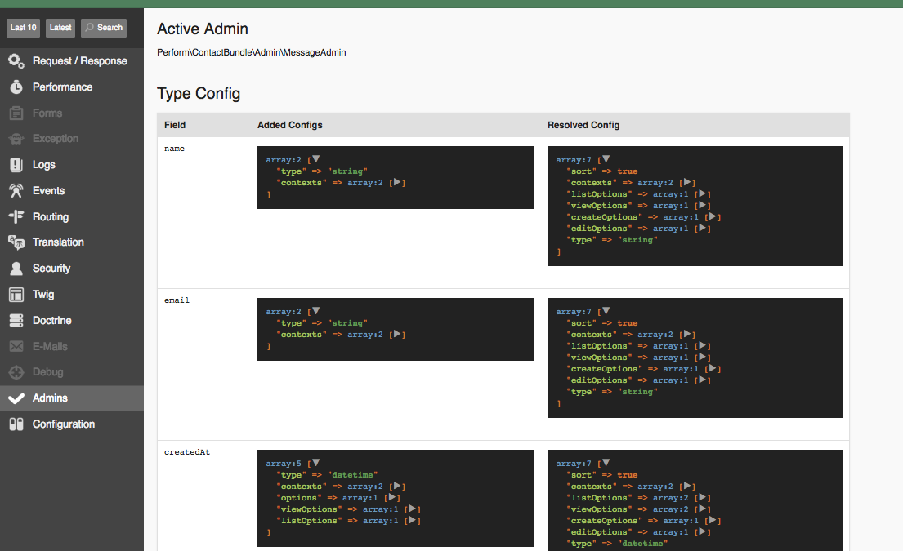

Admins
======

A common requirement in web applications is 'CRUD' operations on your entities, i.e. `create`, `read`, `update`, and `delete`.

Perform introduces the concept of `admins`, classes that configure CRUD operations for different entities.

Creating an admin
-----------------

All admins must implement ``Perform\BaseBundle\Admin\AdminInterface``,
and define services tagged with ``perform_base.admin``.

Implementing ``AdminInterface`` requires creating several methods.
For many cases, extending ``Perform\BaseBundle\Admin\AbstractAdmin`` saves coding time.
The only required code is defining the ``$routePrefix`` property, and implementing ``configureTypes()``.

Suppose we created the Doctrine entity ``AppBundle\Entity\Bike``, with the fields ``model`` (a string) and ``wheelCount`` (an integer).

An example admin class could be:

.. code-block:: php

   <?php

    class BikeAdmin extends AbstractAdmin
    {
        protected $routePrefix = 'myapp_admin_bike_';

        public function configureTypes(TypeConfig $config)
        {
            $config
                ->add('model', ['type' => 'string'])
                ->add('wheelCount', ['type' => 'integer'])
                ;
        }
    }

.. note::

   What are `types` anyway? Read more in the :doc:`next chapter <types>`.

Then define a service for the admin:

.. code-block:: yaml

    app.admin.bike:
        class: AppBundle\Admin\BikeAdmin
        tags:
            - {name: perform_base.admin, entity: "AppBundle:Bike"}

Routing
-------

Perform provides a ``crud`` route loader, which will create routes for an entity admin.

Define a new route resource in ``app/config/routing.yml``:

.. code-block:: yaml

    bike_admin:
        resource: "AppBundle:Bike"
        type:     crud
        prefix:   "/admin/bikes"

Be sure to include a ``prefix`` for the routes.

Some routes have been created with the route prefix we defined in the admin:

.. code-block:: bash

   $ ./bin/console debug:router | grep bike

     myapp_admin_bike_list            ANY      ANY      ANY    /admin/bikes/
     myapp_admin_bike_view            ANY      ANY      ANY    /admin/bikes/view/{id}
     myapp_admin_bike_create          ANY      ANY      ANY    /admin/bikes/create
     myapp_admin_bike_edit            ANY      ANY      ANY    /admin/bikes/edit/{id}

Now visit ``/admin/bikes`` in your browser. A complete CRUD interface is now available!

Contexts
--------

The four letters of CRUD are mapped to different 'contexts':

* The `list` context for displaying a list of entities (read in CRUD)
* The `view` context for inspecting a single entity (read in CRUD)
* The `create` context for creating a new entity (create in CRUD)
* The `edit` context for editing a single entity (update in CRUD)

What about `delete`? See :doc:`actions`.

.. note::

   You'll learn more about contexts, and how to customise admins for each one, in :doc:`types`, :doc:`filters`, and :doc:`actions`.

Customising routing
-------------------

The `crud` loader uses the output of ``AdminInterface#getActions()`` to determine how to create routes.

``AbstractAdmin`` defines some sensible defaults, but you can implement this method in an admin to override them.
It should return an array, where the keys are the url fragments, and the values are the context - `view`, `list`, `create`, or `edit`.

.. code-block:: php

   <?php

   public function getActions()
   {
       return [
           '/' => 'list',
           '/inspect/{id}' => 'view',
           '/create' => 'create',
       ];
   }

.. code-block:: bash

   $ ./bin/console debug:router | grep bike

     myapp_admin_bike_list            ANY      ANY      ANY    /admin/bikes/
     myapp_admin_bike_view            ANY      ANY      ANY    /admin/bikes/inspect/{id}
     myapp_admin_bike_create          ANY      ANY      ANY    /admin/bikes/create

Debug bar
---------

When visiting a route managed by an admin, you'll notice a new item on the debug bar:

.. image:: debug_bar.png

Clicking on this data collector shows useful information about the
active admin, as well as some general information about all loaded
admins.

Overriding templates
--------------------

The template used for an admin action can be overridden in many
different ways.

Here are all the possible ways of overriding a template, in order of priority:

Return a response object from the controller
~~~~~~~~~~~~~~~~~~~~~~~~~~~~~~~~~~~~~~~~~~~~

If an action returns a Symfony ``Response`` object, no template is
needed.

Use twig explicitly or with an annotation
~~~~~~~~~~~~~~~~~~~~~~~~~~~~~~~~~~~~~~~~~

Use ``render()`` or the ``@Template`` annotation to
explicitly render a template in the controller action.

Implement getTemplate() in the admin
~~~~~~~~~~~~~~~~~~~~~~~~~~~~~~~~~~~~

An admin class may implement ``AdminInterface#getTemplate()`` to
return a custom template name.

Place a file in a specific location
~~~~~~~~~~~~~~~~~~~~~~~~~~~~~~~~~~~

The template ``@<Bundle>/admin/<entity>/<context>.html.twig`` will be used
automatically if available,
e.g. ``@PerformContact/Message/view.html.twig``.

Default
~~~~~~~

If nothing else has been specified, the template
``@PerformBase/crud/<context>.html.twig`` will be used.
