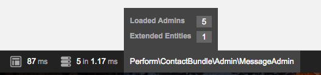

Admins
======

A common requirement in web applications is 'CRUD' operations on your entities, i.e. `create`, `read`, `update`, and `delete`.

Perform introduces the concept of `admins`, a class which configures how to manage entities.

Creating an admin
-----------------

All admins must implement ``Perform\BaseBundle\Admin\AdminInterface``,
and define services tagged with ``perform_base.admin``.

Implementing ``AdminInterface`` requires creating several methods.
For many cases, extending ``Perform\BaseBundle\Admin\AbstractAdmin`` saves coding time.
The only required code is defining the ``$routePrefix`` property, and implementing ``configureTypes()``.

Suppose we created the Doctrine entity ``AppBundle\Entity\Bike``, with the fields ``model`` (a string) and ``wheelCount`` (an integer).

An example admin class could be:

.. code-block:: php

   <?php

    class BikeAdmin extends AbstractAdmin
    {
        protected $routePrefix = 'myapp_admin_bike_';

        public function configureTypes(TypeConfig $config)
        {
            $config
                ->add('model', ['type' => 'string'])
                ->add('wheelCount', ['type' => 'integer'])
                ;
        }

    }

.. note::

   What are `types` anyway? Read more in the :doc:`next chapter <types>`.

Then define a service for the admin:

.. code-block:: yaml

    app.admin.bike:
        class: AppBundle\Admin\BikeAdmin
        tags:
            - {name: perform_base.admin, entity: "AppBundle:Bike"}

Routing
-------

Perform provides a ``crud`` route loader, which will create routes for an entity admin.

Define a new route resource in ``app/config/routing_yml``:

.. code-block:: yaml

    bike_admin:
        resource: "AppBundle:Bike"
        type:     crud
        prefix:   "/admin/bikes"

Be sure to include a ``prefix`` for the routes.

Now visit ``/admin/bikes`` in your browser. A complete CRUD interface is now available!

Contexts
--------

The four letters of CRUD are mapped to 4 different 'contexts':

* The `list` context, when displaying a list of entities (read in CRUD)
* The `view` context, when inspecting a single entity (read in CRUD)
* The `create` context, when creating a new entity (create in CRUD)
* The `edit` context, when editing a single entity (update in CRUD)

What about `delete`? See :doc:`actions`.

You can change how types are configured depending on context.

For example, here we tell the ``datetime`` type to show a human friendly date diff (e.g. `2 hours ago`) in the `list` context, but the full date in the `view` context:

.. code-block:: php

    <?php

    public function configureTypes(TypeConfig $config)
    {
        $config->add('createdAt', [
                'type' => 'datetime',
                'viewOptions' => [
                    'human' => false,
                ],
                'listOptions' => [
                    'human' => true,
                ],
            ]);
    }

Debug bar
---------

When visiting a route managed by an admin, you'll notice a new item on the debug bar:

Clicking on this data collector shows useful information about the
active admin, as well as some general information about all loaded
admins.

.. image:: data_collector.png
