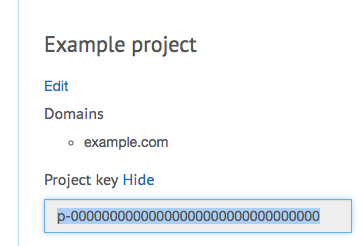

Licensing
=========

Perform is commercial software; you need a license to get the code and run it in production.

Code access
-----------

The bundles and tools are stored in a private packagist repository, which requires an approved SSH key to access.

You can add an SSH key if you have a license that hasn't expired, including a trial.

You are allowed one key for each single and trial license, or unlimited keys if you have a pro or bespoke license.

See :doc:`the installation guide <./install>` for more information.

Deploying a project
-------------------

A project key is required when deploying your applications.

To get a key, create a new project in your `account page </account>`_, specifying the domains you'll use for your application.
Each project will have a different project key.

For deployment, add this key to ``perform_base.project_key`` in your project configuration:

.. code-block:: yaml

   perform_base:
       project_key: p-00000000000000000000000000000000

In a *non-debug* kernel environment, the project key will be validated with Perform's licensing server every time the cache is cleared.
If the project key is invalid, or the domain isn't in the list of valid domains, the application will show an error page.

Expired licenses
----------------

Your keys will continue to work if you've paid for a license (even if it has expired), or have a trial license that hasn't expired.
