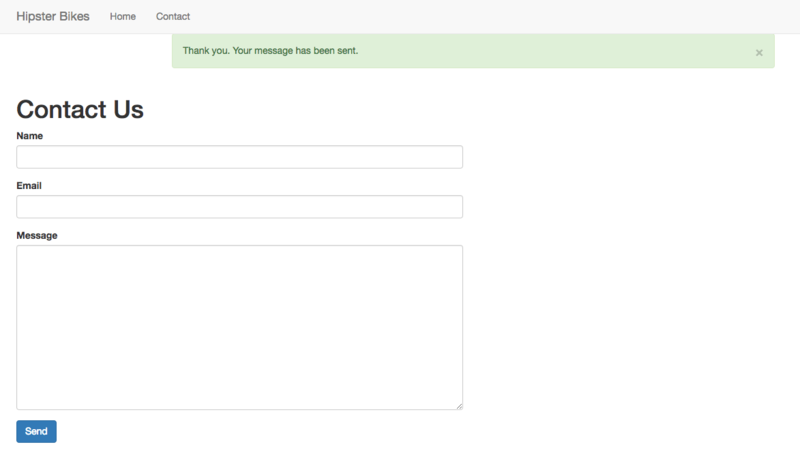
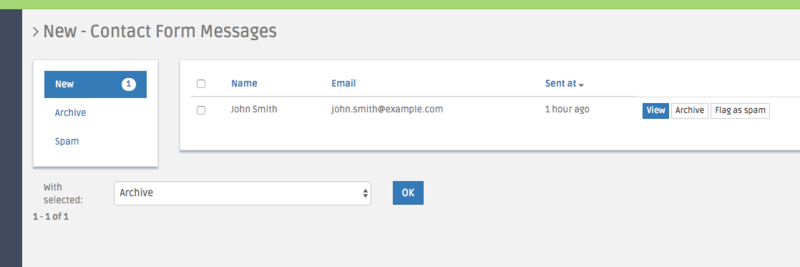

Adding a contact form
=====================

Let's create a new page for a contact form.

Add another controller action to the ``PageController`` class:

.. code-block:: diff

    + /**
    +  * @Route("/contact")
    +  * @Template
    +  */
    + public function contactAction()
    + {
    +     return [];
    + }

and create a new frontend template for it:

.. code-block:: bash

   ./bin/console perform-dev:create:page AppBundle:Page:contact --frontend twbs3

Finally, update the frontend menu in ``nav.html.twig`` to link to the new route.

.. code-block:: diff

      <ul class="nav navbar-nav">
        
          <li><a href="/">Home</a></li>
    +     <li><a href="{{path('app_page_contact')}}">Contact</a></li>
        
      </ul>

.. note::

   We are using the ``path`` twig function to link to the new action, but you could simply write ``/contact`` as well.
   Remember you'll need to update the url manually whe using this method if the route ever changes.

   ``nav.html.twig`` was generated by the bootstrap 3 frontend.
   Not all frontends will create this file; you may need to update the
   frontend menu (if one even exists) in a different file when using a different frontend.

Integrating PerformContactBundle
--------------------------------

The PerformContactBundle provides a contact form type, with tools to handle submissions and sending of notifications when a message is sent. We'll use this bundle to construct a contact form quickly.

Update the ``contactAction`` method:

.. code-block:: diff

    + use Symfony\Component\HttpFoundation\Request;
    + use Perform\ContactBundle\Form\Type\MessageType;

.. code-block:: diff

      /**
       * @Route("/contact")
       * @Template
       */
    - public function contactAction()
    + public function contactAction(Request $request)
    + {
    +     $form = $this->createForm(MessageType::class);
    +     $handler = $this->get('perform_contact.form.handler.contact');

    +     try {
    +         $result = $handler->handleRequest($request, $form);
    +         if ($result) {
    +             $this->addFlash('success', 'Thank you. Your message has been sent.');

    +             return $this->redirectToRoute('app_page_contact');
    +         }
    +     } catch (\Exception $e) {
    +         $this->get('logger')->error($e);
    +         $this->addFlash('error', 'An error occurred. Please try again.');
    +     }

    -     return [];
    +     return [
    +         'form' => $form->createView(),
    +     ];
      }

This will look familiar if you've used forms in a Symfony controller action before.
We create a new form with ``Perform\ContactBundle\Form\Type\MessageType``, redirecting with a flash message on success, and showing an error message on failure.
However, instead of handling the form submission ourselves, we get the ``perform_contact.form.handler.contact`` service to handle it for us.
This service checks the form submission, saves a new message to the database, checks for spam, and sends notifications when configured.
See the :doc:`PerformContactBundle documentation <../bundles/contact/index>` for more information on how this works.

Now update ``contact.html.twig``:

.. code-block:: diff

    - 

    -   <h1>Contact</h1>
    + 

    +   <h1>Contact Us</h1>
    +   {{form_start(form)}}
    +   {{form_row(form.name)}}
    +   {{form_row(form.email)}}
    +   {{form_row(form.message)}}
    +   <button type="submit" class="btn btn-primary">Send</button>
    +   {{form_end(form)}}
      

Head to the new page at http://127.0.0.1:8000/contact and fill out the form.
The page should refresh, and you'll be shown a success message.

Now head to the admininstration area and click on the 'Contact Form' link.
You'll see a grid of form submissions, with buttons to archive messages you've dealt with and mark messages as spam.

Configuring notifications
-------------------------

You can be notified of successful form submissions in a variety of ways.

By default, email notifications will be sent to the email address you configure in the settings page.
Open the 'Contact Form' panel in the 'Settings' page of the admin and add an email address to send notifications too.

.. image:: contact_settings.png

Depending on your system, you might need to update the swiftmailer bundle configuration to send emails correctly.
By default, it uses the values of the ``mailer_*`` parameters in ``app/config/parameters.yml``.
See the `Swiftmailer bundle documentation <http://symfony.com/doc/current/email.html>`_ for more information.

The ``delivery_address`` setting can be useful for local development.
All emails will be sent to this address, with the original address being included

Once you've configured email sending, try submitting the form again.
You'll be sent an email notification with details of the submission.

Extending the Message entity
----------------------------
