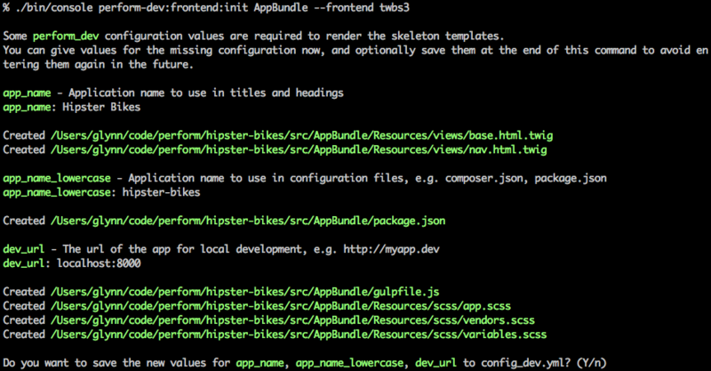

Adding frontend pages
=====================

Now we've got a basic admin area working, let's create some frontend pages to display the bikes.

Create base files
------------------

Perform doesn't impose any structure on the frontend of your application, however the DevBundle does provide optional tools to build a frontend quickly.

Let's use the ``perform-dev:frontend:init`` command to create some basic files in the AppBundle:

.. code-block:: bash

   ./bin/console perform-dev:frontend:init AppBundle --frontend twbs3

This command will ask for information when generating some of the files, such as ``app_name`` - the name of our app to use for headings and titles.
You can give any answers, but make sure to give a correct
value for ``dev_url`` if you want browsersync live asset reloading to
work correctly.
We'll use ``localhost:8000`` since we're using the built-in server for this tutorial.

Using ``twbs3`` for the frontend option has incorporated Twitter
Bootstrap 3 in the generated files, including a ``package.json`` with
the relevant packages and ``gulpfile.js`` with tasks to build the
assets.

.. note::

   A ``frontend`` is a concept restricted to the DevBundle, and is only used when generating new code.

   It is not designed to impose any restrictions on the layout of your application, but simply as a way to generate common frontend files in different ways.

   Other frontends are available; use the ``perform-dev:debug:frontends`` command to see them.

   You can create your own frontends too. See :doc:`the documentation for the DevBundle <../bundles/dev/frontends>`.

Add a route
-----------

Loading bikes
-------------

Styling
-------
