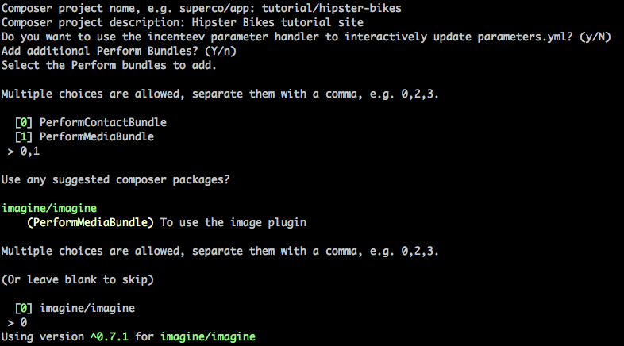

Setup
=====

We'll use the Perform cli to scaffold an application for us.

Create a new directory and then run ``perform init`` inside it:

.. code-block:: bash

   mkdir hipster-bikes
   cd !$
   perform init

The cli will ask you some questions during setup:

**Composer project info**: the name and description of your application to go in composer.json.
We'll use the name ``tutorial/hipster-bikes``, but feel free to pick any name.

**Incenteev parameters**: Perform tries to be as lean as possible out of the box, so will remove ``incenteev/composer-parameter-handler`` if you don't require it.
Answering no means you'll have to manage ``app/parameters.yml`` by hand.

**Additional bundles**: any additional Perform bundles to include in this application.
Pick the ``PerformMediaBundle`` and ``PerformContactBundle`` from the options.

**Optional composer packages**: the bundles we added can suggest optional composer packages for richer functionality.
Pick ``imagine/imagine`` so we can use images in the media library.

**Creating a new bundle**: we need to create a bundle for our application code.
Choose the ``AppBundle`` option, which simplifies things slightly.

.. note::

   ``perform init`` simply wraps ``composer create-project`` and commands from the PerformDevBundle in a single, easy to use command.

Configure a web server
----------------------

Set up a web server and database for the app to use.

There are many options, but for the sake of this tutorial we will use PHP's built in server and sqlite, which requires no additional setup.

.. note::

   You could also setup Nginx or Apache, and a database using MySQL or PostgreSQL.
   These could run directly on your machine, a vagrant box, or even some docker containers.

   See the `symfony docs <http://symfony.com/doc/current/setup.html#go-deeper-with-setup>`_ for more information.

Configure parameters
--------------------

Configure doctrine to connect to your database in ``app/config/parameters.yml``.

Since we're using sqlite in this tutorial, we can ignore that and simply update ``app/config/config.yml``:

.. code-block:: yaml

    doctrine:
        dbal:
            driver: pdo_sqlite
            path: '%kernel.root_dir%/sqlite.db'
            charset: UTF8

Create database schema
----------------------

Create the database you specified in the last step (a sqlite database will be created automatically).

Then update the database schema:

.. code-block:: bash

   ./bin/console doctrine:schema:update --force --dump-sql

.. note::

   In a production setting you'll want to use migrations instead of the schema creation tool to avoid data loss.

Create a user account
---------------------

Run the ``perform:user:create`` command to create a new user.

.. code-block:: bash

   ./bin/console perform:user:create

Enter a name, email, and password.

Login to the default dashboard
------------------------------

Start your configured webserver.
We'll use the built-in server command:

.. code-block:: bash

   ./bin/console server:run

   # [OK] Server running on http://127.0.0.1:8000

Head to http://127.0.0.1:8000/admin.
You'll see a login page; enter the email address and password you gave in the previous step.

Congratulations!
We've created and configured a brand new Symfony application using the Perform bundles we require, and have an admin area ready to customise.
