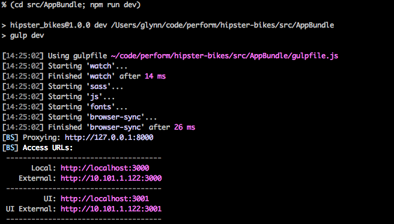

Styling
=======

The home page could use some styling tweaks to really show off the wonderful trendy bikes.

Using gulp
----------

The twitter bootstrap 3 frontend has generated a ``gulpfile.js`` file
with sass compilation and live reloading with browsersync.

It has two main tasks: ``build`` for building the assets, and ``dev`` for live compilation of the assets with a browsersync proxy.
Both of these tasks are included as scripts in the generated ``package.json``.

Let's start the browsersync proxy server:

.. code-block:: bash

   (cd src/AppBundle; npm run dev)

Gulp should build the assets, then start a server that will act as a proxy to the PHP server.

Open the link given to you by the proxy process, in our case http://localhost:3000.

You should see the home page again, except this time any changes to our assets will be injected into the browser.

Add a new css rule to ``src/AppBundle/Resources/scss/app.scss`` to test it out:

.. code-block:: diff

      body {
        padding-top: $navbar-height;
    +   background-color: rebeccapurple;
      }

And watch as the style of the page is updated without a reload.

Browsersync can do a lot. Visit https://www.browsersync.io/ to find out more.

Bike carousel
-------------

We'll leverage twitter bootstrap's built-in carousel to showcase our bike gallery.

Update ``src/AppBundle/Resources/views/home.html.twig``:

.. code-block:: diff

        

    -        
    -          <h2>{{bike.title}}</h2>
    -          
    -          

    -            {{bike.description | nl2br}}
    -          

    -        
    +
    +        

    +          <ol class="carousel-indicators">
    +            
    +              <li data-target="#bike-carousel" data-slide-to="{{loop.index0}}" class="active"></li>
    +            
    +          </ol>
    +          

    +
    +            
    +              

    +                
    +                

    +                  <h2>{{bike.title}}</h2>
    +                  

    +                    {{bike.description | nl2br}}
    +                  

    +                

    +              

    +            
    +
    +          

    +          <a class="left carousel-control" href="#bike-carousel" role="button" data-slide="prev">
    +            
    +            Previous
    +          </a>
    +          <a class="right carousel-control" href="#bike-carousel" role="button" data-slide="next">
    +            
    +            Next
    +          </a>
    +        

    +
        

And add some styles to ``src/AppBundle/Resources/scss/app.scss`` as you see fit:

.. code-block:: diff

    + #bike-carousel {
    +   max-height: 600px;
    +
    +   .carousel-caption {
    +     background-color: rgba(0, 0, 0, 0.4);
    +   }
    +
    +   img {
    +     width:100%;
    +     max-height: 600px;
    +   }
    + }

That's better.

.. image:: carousel.png
